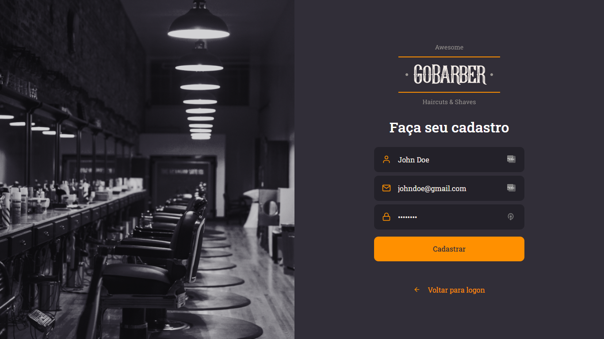
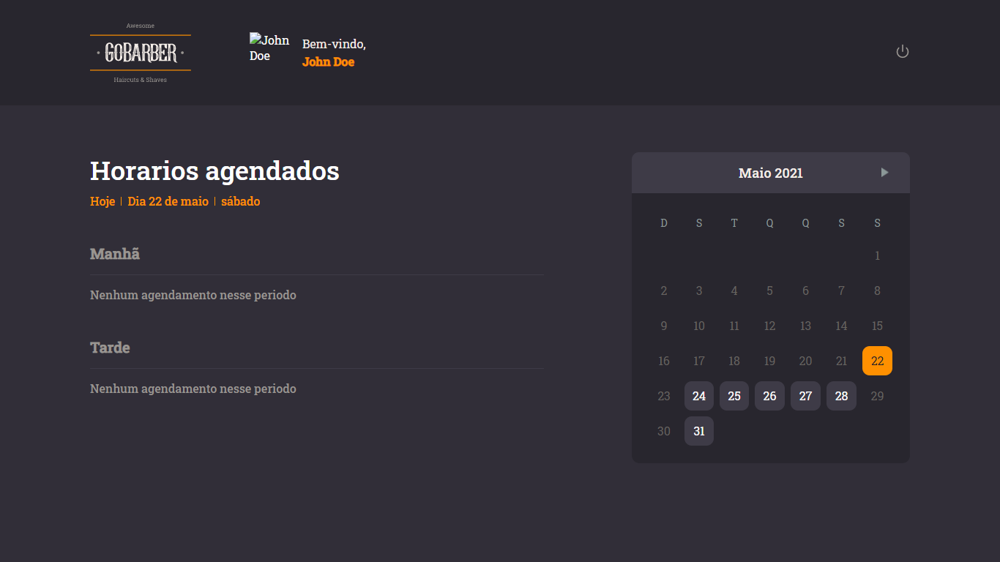

## Table of Contents
* [Introduction](#introduction)
* [Tecnologies](#tecnologies)
* [Features](#features)
* [How To Use](#how-to-use)


## Introduction

This is a barbershop website where the user can create an account and make an appointment. 

Acess the [BACKEND](https://github.com/ardotheedu/GoStackAulas/tree/master/iniciando-back-end).

Acess the [MOBILE](https://github.com/ardotheedu/AppGoBarber) version.

## Tecnologies

* React
* TypeScript
* Styled-components

## Features

A few of the things you can do with GoBarber:

* Create a account
* Sign in
* Make appointments
* Change your profile 

<p align="center">
  
</p>
<p align="center">
  
</p>

<p align="center">
  
</p>

## How To Use

To clone and run this application, you'll need the [Backend](https://github.com/ardotheedu/GoStackAulas/tree/master/iniciando-back-end), Git and Node.js (which comes with npm) installed on your computer. From your command line:
```bash
# Clone this repository
$ git clone https://github.com/ardotheedu/GoBarber

# Go into the repository
$ cd GoBarber

# Install dependencies
$ yarn

# Run the app
$ yarn start
```
Open [http://localhost:3000](http://localhost:3000) with your browser to see the result.


